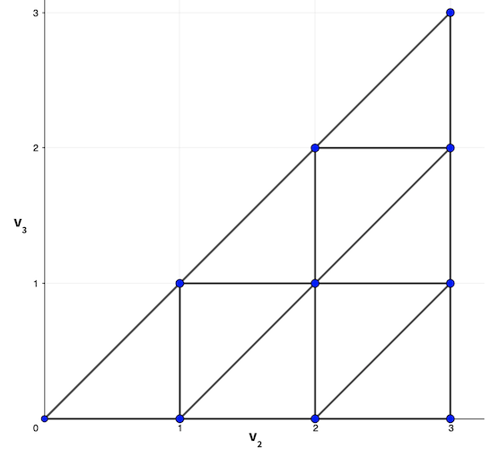

# Concepts

## Freudenthal Triangulation

Freudenthal triangulation of a continuous space produces a set of vertices with integer coordinates. If we are working in an ``n`` dimensional space with a granularity of ``m > 0``, then we will get a set of vertices of the form ``[v_1, v_2, \dots, v_n]`` where ``m = v_1 \ge v_2 \ge \cdots \ge v_n \ge 0``.

One example of a Freudenthal triangulation with `n = 3` and `m = 3` is shown below. Note that ``v_1`` is always `3` so the diagram only shows ``v_2`` and ``v_3.``



Thus the vertices of the Freudenthal discretization of a 3-dimensional space with ``m=3`` has 10 vertices:
```math
\begin{Bmatrix} [3,0,0] & [3,1,0] & [3,2,0] & [3,3,0] \\  & [3,1,1] & [3,2,1] & [3,3,1] \\ & & [3,2,2] & [3,3,2] \\ & & & [3,3,3] \end{Bmatrix}
```
In general, we can see that there are ``\frac{(m+n-1)!}{m!(n-1)!}`` vertices. This is because we can consider the sequence ``u_2, u_3, \dots, u_n`` where ``u_i = v_i + (n - i)`` for all ``2 \le i \le n.`` Then we must have that since ``v_i \ge v_{i+1}`` for ``2 \le i \le n-1``, this means that ``u_i > u_{i+1}``. We also see that since ``v_2 \le m``, this means that ``u_2 \le m + n - 2`` and since ``v_n \ge 0``, this means that ``u_2 \ge 0``. Therefore, to count the number of vertices in a Freudenthal Triangulation, we must just select ``n-1`` distinct integers in the range ``[0, m+n-2]`` and this will correspond to a unique sequence ``u_2, u_3, \dots, u_n`` and thus it corresponds to a unique vertex ``[v_1, v_2, \dots, v_n]`` where ``m = v_1 \ge v_2 \ge \dots \ge v_n \ge 0.`` Thus there are ``\binom{m+n-1}{n-1} = \frac{(m+n-1)!}{m!}{(n-1)!}`` vertices in a Freudenthal triangulation of an ``n``-dimensional space with granularity ``m``.

## Freudenthal Simplex and Barycentric Coordinates

If we know, the values of a function ``f`` at the integer Freudenthal vertices, we can use triangulation to estimate the value at an arbitrary point ``x`` from the ``n+1`` vertices of the simplex enclosing ``x``:
```math
f(x) = \sum_{i = 1}^{n+1} \lambda_i f(v^{(i)})
```
where the vertices of the simplex containing ``x`` are ``v^{(1)}, \dots, v^{(n+1)}``. The scalars ``\lambda_i`` are barycentric coordinates of ``x`` with respect to the simplex vertices. Recall that barycentric coordinates are non-negative weights that sum to ``1`` such that ``x = \sum_{i = 1}^{n+1}\lambda_i v^{(i)}``.

To first find the coordinates of the simplex containing ``x``, we set the first vertex ``v^{(1)} = [\floor{x_1}, \floor{x_2}, \dots, \floor{x_n}]`` where ``\floor{a}`` is the greatest integer less than or equal to ``a``.

Then we compute ``d = x - v^{(1)}`` and sort the components of ``d`` in descending order ``d_{p_1} \ge d_{p_2} \ge \dots \ge d_{p_n}`` where ``p`` is a permutation of `1:n`. From here the remaining simplex vertices can be constructed as ``v^{(k+1)} = v^{(k)} + e_{p_k}`` where ``e_i`` is the ``i``th standard basis vector.

As an example suppose we wanted to find the simplex vertices for the Freudenthal triangulation of ``x = [1.2, -3.4, 2]``. The first vertex is ``v^{(1)} = [1, -4, 2]`` which means that ``d = [0.2, 0.6, 0.0]``. We then arrange the components in descending order, ``0.6 \ge 0.2 \ge 0.0`` so ``p = [2, 1, 3]``. Thus the remaining simplex vertices are:
```math
\begin{aligned}
v^{(2)} = [1, -4, 2] + [0,1,0] = [1, -3, 2] \\
v^{(3)} = [1,-3,2] + [1, 0, 0] = [2, -3, 2] \\
v^{(4)} = [2, -3, 2] + [0,0,1] = [2,-3,3].
\end{aligned}
```
Now to compute the barycentric coordinates ``\lambda``, we can set
```math
\begin{aligned}
\lambda_{n+1} &= d_{p_n} \\
\lambda_{n} &= d_{p_{n-1}} - d_{p_n} \\
\lambda_{n-1} &= d_{p_{n-2}} - d_{p_{n-1}} \\
\vdots \\
\lambda_{2} &= d_{p_1} - d_{p_2} \\
\lambda_1 &= 1 - \sum_{i=1}^{n+1} \lambda_i.
\end{aligned}
```
We know that since ``d_{p_1} \ge d_{p_2} \ge \dots \ge d_{p_n}`` is a decreasing sequence of real numbers between ``0`` and ``1``, this means that ``0 \le \lambda_i \le 1`` for ``1 \le i \le n+1``. We also have that for each coordinate ``x_j, 1 \le j \le n``, then
```math
\begin{aligned}
\sum_{i=0}^{n+1}\lambda_i v^{(i)}_j = v^{(1)}_j \left(\sum_{i=0}^{n+1} \lambda_i\right) + \sum_{i=j+1}^{n+1}\lambda_i = v^{(1)}_j + d_{p_j} = x_j
\end{aligned}
```
Thus we have the barycentric coordinates of ``x`` with respect to the Freudenthal simplex enclosing ``x``.

We see that in the Freudenthal simplex that we calculated above, the barycentric coordinates are
```math
\begin{aligned}
\lambda_4 &= d_{p_3} = 0.0 \\
\lambda_3 &= d_{p_2} - d_{p_3} = 0.2 \\
\lambda_2 &= d_{p_1} - d_{p_2} = 0.4 \\
\lambda_1 &= 1 - \lambda_2 - \lambda_3 - \lambda_4 = 0.4.
\end{aligned}
```
Then we see that ``[1.2, -3.4, 2] = 0.4 \cdot [1, -4, 2] + 0.4 \cdot [1, -3, 2] + 0.2 \cdot [2, -3, 2] + 0.0 \cdot [2,-3,3]`` so we can confirm that the barycentric coordinates are correct.

Now using these barycentric coordinates and the vertices of the Freudenthal simplex, we will be able to perform function approximation in Freudenthal space.


\[1\] *Algorithms for Decision Making* by
Mykel J. Kochenderfer, Tim A. Wheeler, Kyle H. Wray, MIT Press, 2021
