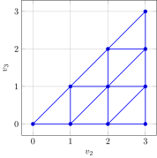

# Concepts

## Freudenthal Triangulation

Freudenthal triangulation of a continuous space produces a set of vertices with integer coordinates. If we are working in an ``n`` dimensional space with a granularity of ``m > 0``, then we will get a set of vertices of the form ``[v_1, v_2, \dots, v_n]`` where ``m = v_1 \ge v_2 \ge \cdots \ge v_n \ge 0``.

One example of a Freudenthal triangulation with `n = 3` and `m = 3` is shown below. Note that ``v_1`` is always `3` so the diagram only shows ``v_2`` and ``v_3.``



Thus the vertices of the Freudenthal discretization of a 3-dimensional space with ``m=3`` has 10 vertices:
```math
\begin{Bmatrix} [3,0,0] & [3,1,0] & [3,2,0] & [3,3,0] \\  & [3,1,1] & [3,2,1] & [3,3,1] \\ & & [3,2,2] & [3,3,2] \\ & & & [3,3,3] \end{Bmatrix}
```
In general, we can see that there are ``\frac{(m+n-1)!}{m!(n-1)!}`` vertices. This is because we can consider the sequence ``u_2, u_3, \dots, u_n`` where ``u_i = v_i + (n - i)`` for all ``2 \le i \le n.`` Then we must have that since ``v_i \ge v_{i+1}`` for ``2 \le i \le n-1``, this means that ``u_i > u_{i+1}``. We also see that since ``v_2 \le m``, this means that ``u_2 \le m + n - 2`` and since ``v_n \ge 0``, this means that ``u_2 \ge 0``. Therefore, to count the number of vertices in a Freudenthal Triangulation, we must just select ``n-1`` distinct integers in the range ``[0, m+n-2]`` and this will correspond to a unique sequence ``u_2, u_3, \dots, u_n`` and thus it corresponds to a unique vertex ``[v_1, v_2, \dots, v_n]`` where ``m = v_1 \ge v_2 \ge \dots \ge v_n \ge 0.`` Thus there are ``\binom{m+n-1}{n-1} = \frac{(m+n-1)!}{m!}{(n-1)!}`` vertices in a Freudenthal triangulation of an ``n``-dimensional space with granularity ``m``.

## Freudenthal Simplex and Barycentric Coordinates

If we know the values of a function ``f`` at the integer Freudenthal vertices, we can use triangulation to estimate the value at an arbitrary point ``x`` from the ``n+1`` vertices of the simplex enclosing ``x``:
```math
f(x) = \sum_{i = 1}^{n+1} \lambda_i f(v^{(i)})
```
where the vertices of the simplex containing ``x`` are ``v^{(1)}, \dots, v^{(n+1)}``. The scalars ``\lambda_i`` are barycentric coordinates of ``x`` with respect to the simplex vertices. Recall that barycentric coordinates are non-negative weights that sum to ``1`` such that ``x = \sum_{i = 1}^{n+1}\lambda_i v^{(i)}``.

To find the coordinates of the simplex containing ``x``, we set the first vertex ``v^{(1)} = [\lfloor x_1 \rfloor, \lfloor x_2 \rfloor, \dots, \lfloor x_n \rfloor]`` where ``\lfloor a \rfloor`` is the greatest integer less than or equal to ``a``.

We then compute ``d = x - v^{(1)}`` and sort the components of ``d`` in descending order ``d_{p_1} \ge d_{p_2} \ge \dots \ge d_{p_n}`` where ``p`` is a permutation of `1:n`. From here the remaining simplex vertices can be constructed as ``v^{(k+1)} = v^{(k)} + e_{p_k}`` where ``e_i`` is the ``i``th standard basis vector.

As an example suppose we wanted to find the simplex vertices for the Freudenthal triangulation of ``x = [1.2, -3.4, 2]``. The first vertex is ``v^{(1)} = [1, -4, 2]`` which means that ``d = [0.2, 0.6, 0.0]``. We then arrange the components in descending order, ``0.6 \ge 0.2 \ge 0.0`` so ``p = [2, 1, 3]``. Thus the remaining simplex vertices are:
```math
\begin{aligned}
v^{(2)} = [1, -4, 2] + [0,1,0] = [1, -3, 2] \\
v^{(3)} = [1,-3,2] + [1, 0, 0] = [2, -3, 2] \\
v^{(4)} = [2, -3, 2] + [0,0,1] = [2,-3,3].
\end{aligned}
```
To compute the barycentric coordinates ``\lambda``, we set
```math
\begin{aligned}
\lambda_{n+1} &= d_{p_n} \\
\lambda_{n} &= d_{p_{n-1}} - d_{p_n} \\
\lambda_{n-1} &= d_{p_{n-2}} - d_{p_{n-1}} \\
\vdots \\
\lambda_{2} &= d_{p_1} - d_{p_2} \\
\lambda_1 &= 1 - \sum_{i=1}^{n+1} \lambda_i.
\end{aligned}
```
We know that since ``d_{p_1} \ge d_{p_2} \ge \dots \ge d_{p_n}`` is a decreasing sequence of real numbers between ``0`` and ``1``, this means that ``0 \le \lambda_i \le 1`` for ``1 \le i \le n+1``. We also have that for each coordinate ``x_j, 1 \le j \le n``, then
```math
\begin{aligned}
\sum_{i=0}^{n+1}\lambda_i v^{(i)}_j = v^{(1)}_j \left(\sum_{i=0}^{n+1} \lambda_i\right) + \sum_{i=j+1}^{n+1}\lambda_i = v^{(1)}_j + d_{p_j} = x_j
\end{aligned}
```
Thus, we have the barycentric coordinates of ``x`` with respect to the Freudenthal simplex enclosing ``x``.

We see that in the Freudenthal simplex that we calculated above, the barycentric coordinates are
```math
\begin{aligned}
\lambda_4 &= d_{p_3} = 0.0 \\
\lambda_3 &= d_{p_2} - d_{p_3} = 0.2 \\
\lambda_2 &= d_{p_1} - d_{p_2} = 0.4 \\
\lambda_1 &= 1 - \lambda_2 - \lambda_3 - \lambda_4 = 0.4.
\end{aligned}
```
We see that ``[1.2, -3.4, 2] = 0.4 \cdot [1, -4, 2] + 0.4 \cdot [1, -3, 2] + 0.2 \cdot [2, -3, 2] + 0.0 \cdot [2,-3,3]``, confirming that the barycentric coordinates are correct.

Now using these barycentric coordinates and the vertices of the Freudenthal simplex, we will be able to perform function approximation in Freudenthal space. Specifically, we will approximate ``f(x)`` as
```math
\begin{aligned}
f(x) \approx \sum_{i = 1}^{n+1} f(v^{(i)}) \lambda_i.
\end{aligned}
```

## Example

Consider the example of ``f(x,y) = \sqrt{(x-1)^2 + (y-1)^2}`` defined on the region ``R = (0, 4) \times (0,4)``. Then for each point ``(x,y) \in R``, we can the Freudenthal simplex which contains ``(x,y)``. We see that these simplices are triangles which are either defined by ``v^{(1)} = (p, q), v^{(2)} = (p + 1, q), v^{(3)} = (p+1, q+1)`` or ``v^{(1)} = (p, q), v^{(2)} = (p, q + 1), v^{(3)} = (p+1, q+1)`` where ``p, q \in \{0, 1, 2, 3\}``. Then we can also find the barycentric coordinates of ``(x,y)`` in its simplex. Finally, we can use the barycentric coordinates ``\lambda_1, \lambda_2, \lambda_3`` to approximate the function ``f`` by
```math
\begin{aligned}
f(x) \approx f(v^{(1)}) \lambda_1 + f(v^{(2)}) \lambda_2 + f(v^{(3)}) \lambda_3.
\end{aligned}
```
For example, we can approximate ``f(1, 1.5)`` by seeing that it is contained in the simplex with vertices ``v^{(1)} = (1, 1), v^{(2)} = (1, 2), v^{(3)} = (2, 2).`` Then we also get that the barycentric coordiantes are ``\lambda_1 = 0.5, \lambda_2 = 0.5, \lambda_3 = 0.`` Therefore, we can approximate ``f`` at ``(1, 1.5)`` by
```math
\begin{aligned}
f(x) \approx 0.5 \cdot 0 + 0.5 \cdot 1^2 = 0.5
\end{aligned}
```
 which is fairly close to the true value of ``0.25``.

The heatmaps of ``f`` and its approximation using Freudenthal triangulation are shown below:


## Belief Space Interpolation
Now if we want to use freudenthal triangulation in belief-state planning, then we need to be able to convert integer vertices in Freudenthal space to form a triangulation of the belief over ``n`` discrete states. This transformation changes the vertex ``v`` into
```math
v' = \frac{1}{m} [v_1 - v_2, v_2 - v_3, \dots, v_{n-1} - v_n, v_n]
```
where ``v'`` represents a valid probability distribution that sums to ``1`` as ``v_1 = m``. The probability assigned to the ``i``th state is given by ``v'_{i}``.

The transformation is equivalent to the matrix multiplication ``v' = Bv`` with
```math
B = \frac{1}{m}\begin{bmatrix} 1 & -1 & 0 & 0 & \cdots & 0 \\ 0 & 1 & -1 & 0 & \cdots & 0 \\ \vdots & & & & & \vdots \\ 0 & 0 & \cdots & & 1 & -1 \\ 0 & 0 & \cdots & & 0 & 1 \end{bmatrix}.
```
This matrix ``B`` is invertible so the opposite transformation can be done. Hence any belief ``b`` can thus be mapped into Freudenthal space to obtain its counterpart ``x = B^{-1}b``. It turns out that the ``i``th component of ``B^{-1}b`` is simply ``m \sum_{k = i}^n b_k.``
Now that we have the ability to convert between belief space and Freudenthal space. We showed above how to interpolate in Freudenthal space with integer simplex vertices. To interpolate in belief spac,e we simply use the transformation to the belief space. Suppose we know the values ``\mathcal{U}(b)`` at all of the vertices ``v'`` in the belief triangulation. Given any new belief ``b`` we can compute ``x = B^{-1}b``, find the vertices ``v^{(1)}, v^{(2)}, \dots, v^{(n+1)}`` of the corresponding simplex in the original Freudenthal triangulation and then compute the barycentric coordinates ``\lambda = (\lambda_1, \lambda_2, \dots, \lambda_{n+1})`` for ``x.``
The interpolate value is then:
```math
\mathcal{U}(b) = \sum_{i=1}^{n+1} \lambda_i \mathcal{U}(v'^{(i)}) = \sum_{i = 1}^{n+1} \lambda_i \mathcal{U}(Bv^{(i)}).
```


\[1\] [*Algorithms for Decision Making*](https://algorithmsbook.com/) by
Mykel J. Kochenderfer, Tim A. Wheeler, Kyle H. Wray, MIT Press, 2022
